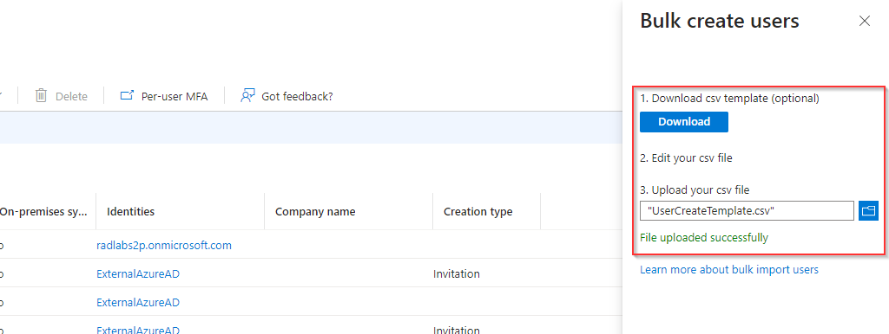
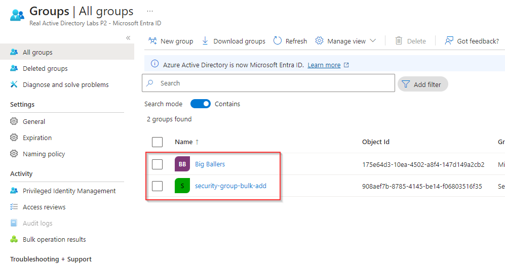
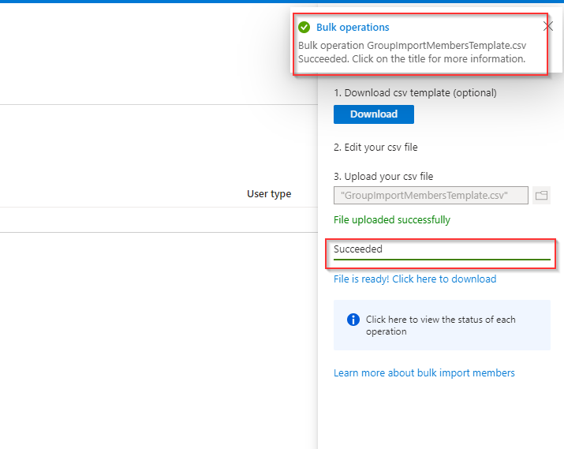

# Perform Bulk Microsoft Entra ID Operations in the Portal

**There are 3 objectives with this lab:**
* Bulk Create Users
* Bulk Delete Users
* Bulk Add Group Members

## Bulk Create Users

The first objective requires us to create 3 users using the `Bulk` option in Entra ID. So first things first, lets navigate to the Entra ID section of the portal

Next, we'll look on the left to the Users blade. Lets click that to get one step closer to our Bulk operations.  

Once here, I looked at the top of the screen and saw the `Bulk operations` tab where we're presented with multiple options: Create, Invite, and Delete. We're going to choose the `create` option. 

Once you're pressed `Bulk create`, yoou'll be given an Excel file where you need to add your user information into. 

Make sure you give each user a first and last name, an email address with the proper domain (I mistakenly gave everyone `@contoso.com`), and a temporary password. If you don't give the information precisely, the Azure portal won't accept the file (as we'll see shortly). 

When you're done, save it and upload it to the Azure. It will say `File uploaded successfully` and then Azure will deploy it. 

I ended up getting a failed deploy and it was saying I didn't have the proper domain for the email addresses. 

I went back into the Entra ID section and looked at the users. I noticed the domain the other users had (`@radlabs2p.onmiscrosoft.com`) so I knew I had to change the domain for the users I created. 

I went back and changed the domain name for the three users. 

Once I reuploaded the updated Excel spreadsheet, I received a `Succeeded` notification.

Afterwards, I checked the users to see if they were populated in the table and they were there!

Objective completed. On to the deletion objective.

## Bulk Delete Users

For the next objective, we were tasked with bulk deleting users. Similar to the bulk create, we navigated back to users and `Bulk operations`. We then downloaded the `Bulk delete` spreadsheet.

I put the email address of the three users I created into the spreadsheet and then uploaded it to Azure. You should also receive a `Succeeded` message here as well. 

After the operation was deployed, you can check the `Users` tab to see if the users were deleted. In my case, the users were no longer in the table. 

Objective completed! Last but not least, the final objective. 

## Bulk Add Group Members

For the last objective, we need to bulk add members to a group. In order to do that, we need to navigate to the `Groups` tab in Entra ID. 

Once there, we have to create a security group first and then a normal group. I later found out we only needed the security group and we could've added the users to the security group but that's fine for now. So click on `New Group` at the top of the Group page. 

Once here, choose `Security` for the Group Type. Click through the rest of the options and save. 

After the security group, I created a Microsoft 365 group called `Big Ballers` in which I'll store my bulk users. 

Here are the two newly created Entra ID Groups:

Now, we have to add the users to the group. I clicked on the Big Ballers group, went to the Members tab on the left, and then chose Bulk operations > Import members

To bulk add members to a group, you'll be forced to download a new Excel sheet. This sheet will ask for the principal or user name when you can just copy from the Entra ID Users page. 

I copied and pasted the emails into the document:

Once all the emails were added, I uploaded the document to the portal and received a `Succeeded` notification alerting me that the bulk invite operation was successful.

You can doublecheck your results by going to the `Members` tab in the selected group (in our case, Big Ballers) and all the members in the Excel spreadsheet should be listed in the group now. 

Lab completed!

## Personal Notes

Another easy lab. The hardest part was figuring out why the first spreadsheet upload failed. This is a reminder to never just copy and paste. Actually observe what's already present in the system. 
